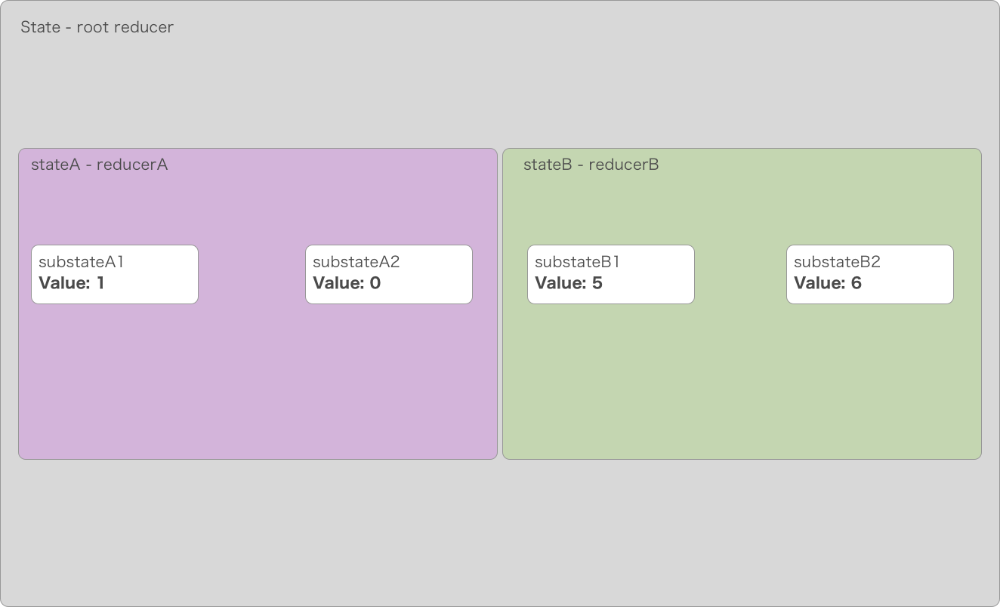
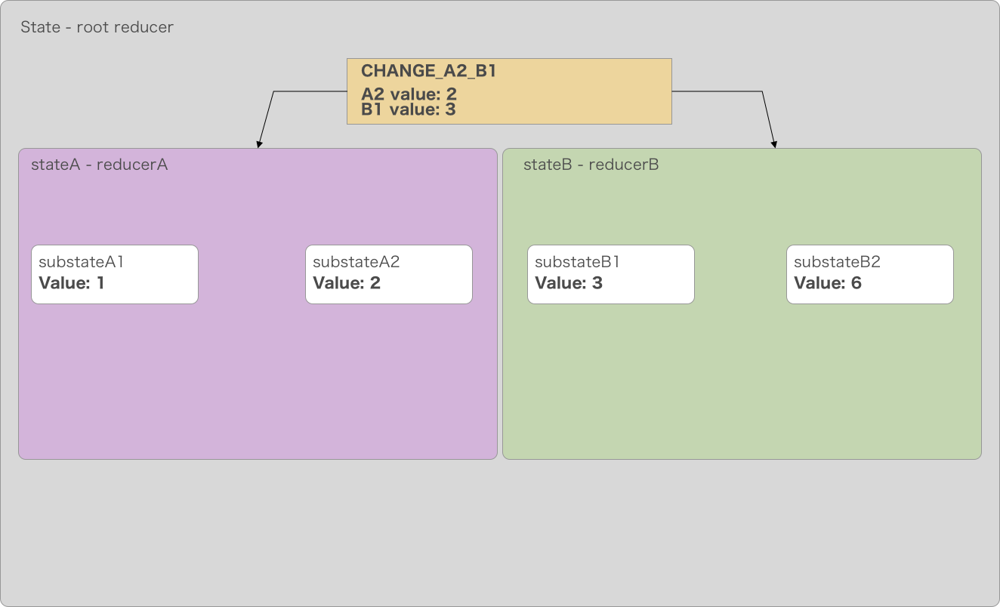

# Redux reducer composition method
A method for nesting reducers in redux.

Our initial state looks like this.


````js
state= {
	stateA: {
		substateA1: {
			value: 1
		},
		substateA2: {
			value: 0
		}
	},
	stateB: {
		substateB1: {
			value: 5
        },
                substateB2: {
			value: 6
		}
	}
}
````

Ordinarily, stateA and stateB would be handled by separate reducers, which can be composed using `combineReducers`. However if the values in `stateA` depend on the values of `stateB` or they need
to interact in any way we need a better way to compose the reducers so that they have access to eachother's state slices.

This method uses the parent reducer to handle actions that involve updating both `stateA` and `stateB` at once. The parent reducer looks like this:

````js
const nestedReducers = (state, action) => {
	return {
		stateA: reducerA(state.stateA, action),
		stateB: reducerB(state.stateB, action)
	}
};

const rootReducer = (state = {}, action) => {

	switch (action.type) {
		default: {
			const rest = nestedReducers(state, action);
			return {...state, ...rest}
		}

	}
};
````

`rootReducer` handles the entire state. `reducerA` and `reducerB` are nested inside it, and they only have access to their respective state-slices. Now we need to handle an action that
needs to update both `stateA` and `stateB`.



This action is handled by the `rootReducer`:

````js
const nestedReducers = (state, action) => {
	return {
		stateA: reducerA(state.stateA, action),
		stateB: reducerB(state.stateB, action)
	}
};

const rootReducer = (state = {}, action) => {
	switch (action.type) {
        case 'CHANGE_A2_B1': {
            return {
                stateA: {
                    ...state.stateA,
                    subStateA2: {
                        value: 2
                    }
                },
                stateB: {
                    ...state.stateB,
                    subStateB1: {
                        value: 3
                    }
                }
            }
        }
        
        default: {
            const rest = nestedReducers(state, action);
            return {...state, ...rest}
        }
    }
};
````

What happens here is that the parent reducer handles the action at the top level and having access to the entire state updates both state slices. All other actions are passed down to the
composed reducers through the default case.

#### Further reading

[Alternative methods for state sharing from the official documentation](https://redux.js.org/recipes/structuringreducers/beyondcombinereducers)

[combineReducers and reduceReducers explained](https://stackoverflow.com/questions/38652789/correct-usage-of-reduce-reducers/44371190#44371190)